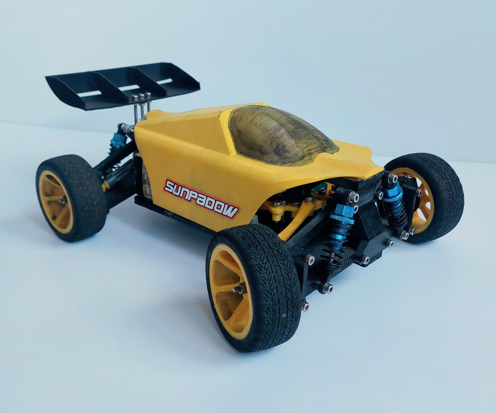

# Kestrel - A 3D printable 1:14th RC car

 
This is the repo for the design files for my 3D printable RC buggy, the Kestrel. The primary goal was to make the Kestrel fun to drive in a lot of situations, so it is not particularly good for racing, bashing, or drifting, but it can do a bit of each. I also wanted to design the Kestrel to be smaller than many other 3D printed buggies, so it is roughly 1:14 scale. Here are some of the features:
- Rear-wheel drive using a belt
- No differential (this enables the car to be simpler and more robust)
- Uses oil-filled adjustable shocks
- Fits rubber tyres
- Can be used with TPU drive axles for higher durability

## Parts List
Here are the parts that you need to build this car:

### Materials
- ~500g of filament - I used ESUN PLA+ for every part of the print
- 12x `6700-2RS` bearings
- 4x 60mm RC car shocks - Ensure that both ends of the shock have an open hole and not a ball joint
- 4x RC car tyres - I used 1:10 touring car tyres which can be found [here](https://www.amazon.co.uk/gp/product/B0BHDSPXZH/ref=ox_sc_act_title_1?smid=A1N8E4Q081571L&psc=1). If you want to use different tyres it should be straightforward to modify the wheel file to fit them.
- 6mm wide 2GT/GT2 circular belt with a length of about 170mm - I have successfully used a belt that I spliced to the correct size.
- Sticky velcro
- Some sort of grease to reduce friction between 3d printed gears - I am using bike grease
- A set of M3 bolts and nuts of varying lengths
- Superglue/Glue gun

### Electronics
- `MG90S` servo
- `EMAX 2213` motor
- 2S/3S LiPo battery - I am using 3S
- ESC
- Receiver
- Gyro (Optional) - I have found that due to the locked diff, the car really likes to spin out. I am also not a very good driver though, so you might not need this.

## Build instructions
I am working on making a video showing how to build the car. I will link it here when I am done.

## CAD
For this project I am using [FreeCAD Link Branch 2023-01-31](https://github.com/realthunder/FreeCAD/releases/tag/2023.01.31-edge). You can try it out with a different version of FreeCAD, but it may break.
